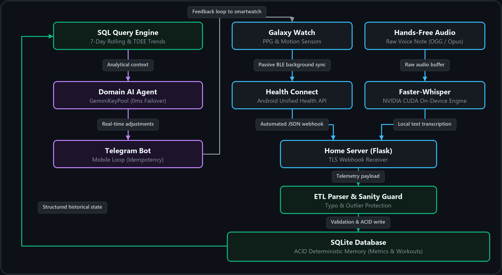

# 🦾 Personal AI Fitness & Nutrition Coach

[](https://fastapi.tiangolo.com)
[](https://www.python.org/)
[](https://www.docker.com/)
[](#)

> 🌐 **English** · [Polski](README.pl.md)

**An intelligent assistant combining smartwatch telemetry, voice notes, and AI agents. Replaces manual food logging and workout tracking with automated analysis and real-time feedback.**

---

## System Architecture & Data Flow

<div align="center">
  
</div>
<p align="center"><i>End-to-end pipeline: from passive smartwatch telemetry and local GPU speech transcription to stateful relational storage and AI reasoning.</i></p>

---

### 1. Voice and Text Input
No need to search food databases or manually log exercise sets. Just dictate what you ate or describe how a workout set felt. The language model automatically handles rough estimates and real-time corrections as you speak:

> 🗣️ *"I ate a 120g banana, some sauerkraut, and a fig... wait, no, the fig was spoiled, so I only ate half."*

<div align="center">
  
</div>

---

### 2. Automated Smartwatch Data
A smartwatch connected to Health Connect automatically pushes telemetry to a local home server: daily steps, heart rate zones, calories burned, or workout duration. Everything lands directly into an SQLite database:

```log
[2026-09-14 12:08:17] === SERVER START ===
[2026-09-14 12:08:17] Active Ngrok tunnel: "https://[tunnel-id].ngrok-free.dev" -> "http://localhost:5000"
[2026-09-14 22:31:21] POST /webhook
[2026-09-14 22:31:21] Raw JSON written to disk.
[2026-09-14 22:31:21] ETL parser finished. SQLite database updated.
[2026-09-14 22:33:43] Voice note received: "120g banana, a handful of walnuts, and half a fig"
[2026-09-14 23:49:27] POST /webhook
[2026-09-14 23:49:27] ETL parser finished. SQLite database updated.
```

```json
// Authentic payload received from the watch via webhook
{
  "workouts": [
    {
      "exercise": [{"type": "calisthenics", "duration_seconds": 3000}],
      "heart_rate": [
        {"time": "2026-09-14T14:05:00Z", "bpm": 145},
        {"time": "2026-09-14T14:10:00Z", "bpm": 152}
      ],
      "total_calories": [{"calories": 620}]
    }
  ]
}
```
*The server automatically organizes raw watch telemetry into a clean workout log without manual intervention.*

---

### 3. Meal Recognition and Calorie Balancing
The agent only needs plain text — it automatically calculates calories and macronutrients while comparing the balance against your daily target:

<div align="center">
  
</div>
<p align="center"><i>Macronutrient extraction: converting casual voice logs into calorie targets and remaining daily goals.</i></p>

---

### 4. Real-Time Workout Guidance
During workouts, the assistant adapts on the fly. When reporting elbow discomfort, it immediately identifies joint fatigue and adjusts the next set — recommending a safer exercise progression, controlled tempo, and reduced load:

<div align="center">
  
</div>
<p align="center"><i>Live workout intervention: adjusting volume and switching to safer progressions mid-session.</i></p>

---

### 5. Input Validation and Database Protection
The system guards database integrity against typos and measurement anomalies. If an unrealistic weigh-in is entered (e.g., 37.6 kg instead of 83.6 kg), a sanity check flags the outlier, pauses the transaction, and asks for confirmation before updating rolling averages:

<div align="center">
  
</div>
<p align="center"><i>Sanity check: catching outlier input, halting database write, and requesting confirmation.</i></p>

---

### 6. Rolling Metrics and Weekly Reports
The system maintains daily rolling metrics and cumulative balances, generating a comprehensive analytical report at the end of each week. It calculates true energy expenditure (TDEE) based on bodyweight trends, correlates cardiovascular recovery with training strain, and tracks strength progression across working sets:

<div align="center">
  
</div>
<p align="center"><i>Weekly analytical review: true energy expenditure, recovery indicators, and strength progression.</i></p>

---

### 7. Mobile Conversational Interface
Full integration with Telegram enables completely mobile, hands-free operation. Users dictate voice notes directly into their smartwatch while cooking or training. A local GPU-accelerated speech model transcribes the audio, and the assistant instantly returns coaching advice in chat:

<div align="center">
  
</div>
<p align="center"><i>Fact-based response: the agent transcribes a 17-second voice note, compares ingredients against yesterday's log, and updates the daily macro budget for the upcoming session (TRAINING DAY — PULL) in real time.</i></p>

---

### 🛠️ Technology Stack & Deployment

* **Core Backend:** Asynchronous FastAPI (ASGI), Pydantic v2 validation models, and Uvicorn production runner.
* **Interactive API Documentation:** Interactive Swagger UI accessible live at `http://localhost:8000/docs`.
* **Containerization:** Multi-stage Docker build (`python:3.13-slim-bookworm`) with Docker Compose profiles:
  * **CPU Profile (`--profile cpu`):** Ultra-lightweight container (~350 MB) for standard telemetry webhooks and cloud Gemini LLM routing.
  * **GPU Profile (`--profile gpu`):** Hardware-accelerated container (~1.9 GB) leveraging NVIDIA Container Toolkit passthrough for local Faster-Whisper (`large-v3`, CUDA float16).
* **Data Storage & Integrity:** Relational SQLite configured in WAL mode with Host Bind Mounts and single-writer safety guarantees.
* **Automated Quality Gate:** 23 unit and integration tests executing in <0.2s with full mock isolation.

```bash
# Clone repository
git clone https://github.com/robertgdaniec/project-coach.git
cd project-coach

# Copy environment template
cp .env.example .env

# Run via Docker (CPU Profile)
docker compose --profile cpu up -d

# Run via Docker (GPU Profile with NVIDIA CUDA passthrough)
docker compose --profile gpu up -d
```

---

### Technical Summary
Project Coach connects a mobile chat interface, a local database, and specialized AI agents into a single unified pipeline. It eliminates the friction of manual tracking while delivering objective analytics, data integrity, and actionable coaching recommendations for every workout.

---
*Author: Robert Gdaniec — Marketing Operations & Automation Specialist*  
*[LinkedIn Profile](https://www.linkedin.com/in/robertgdaniec/) | [Contact](mailto:robert.gdaniec@gmail.com)*
