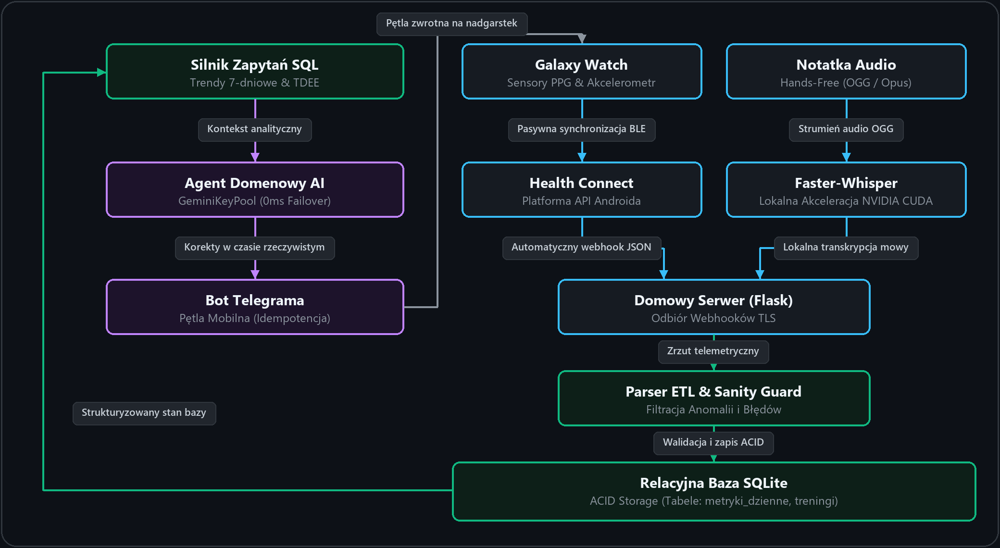
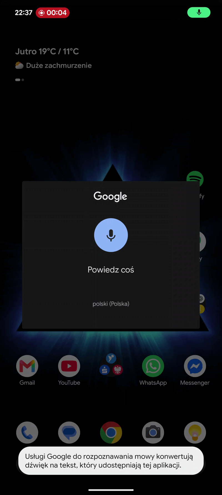
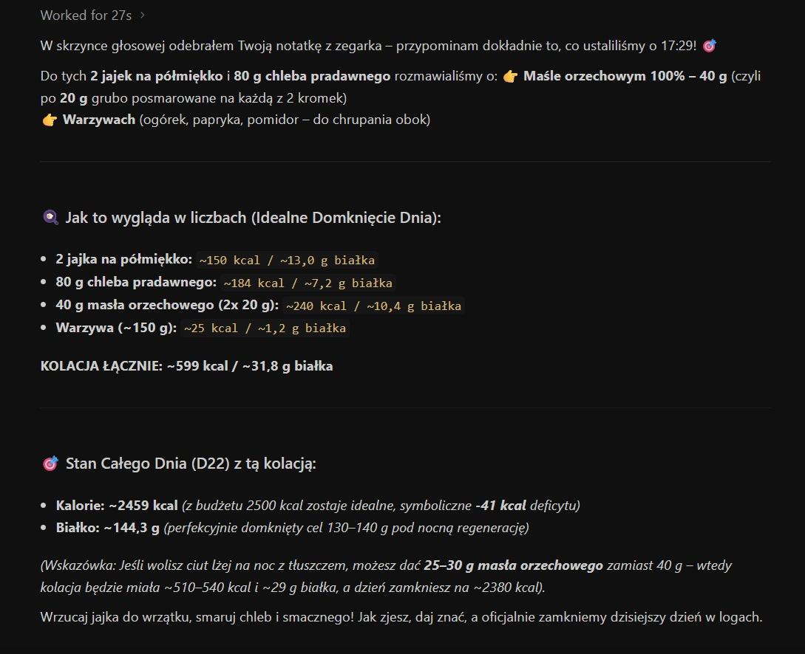
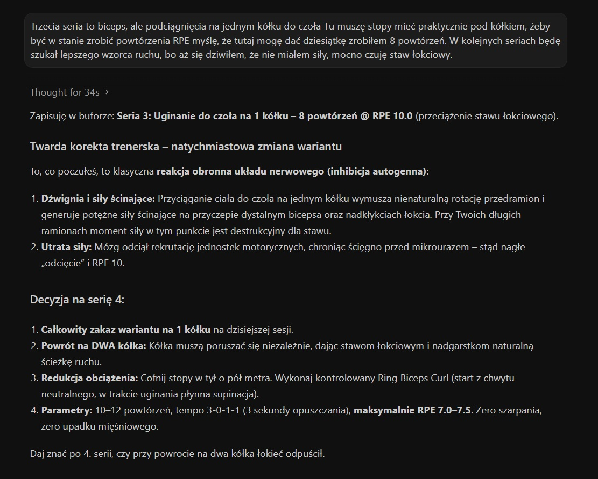
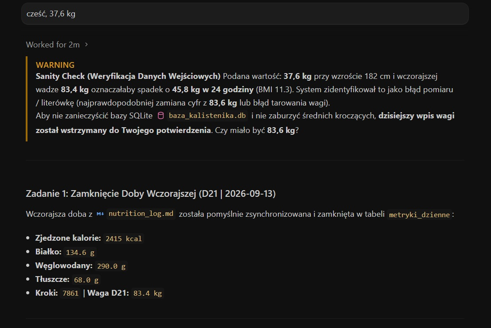
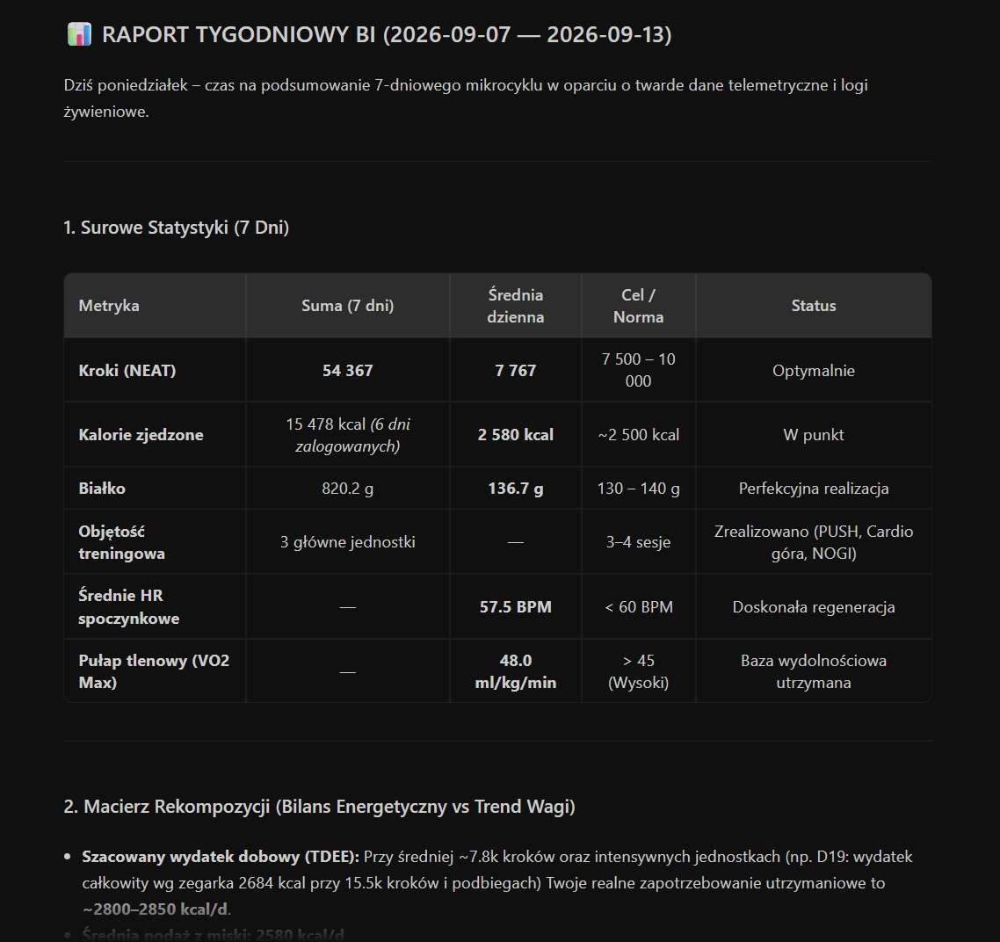
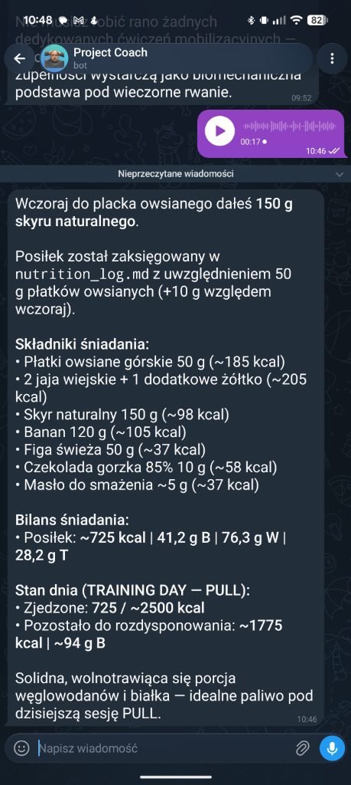

# 🦾 Personal AI Fitness & Nutrition Coach

[](https://fastapi.tiangolo.com)
[](https://www.python.org/)
[](https://www.docker.com/)
[](#)

> 🌐 [English](README.md) · **Polski**

**Inteligentny asystent, który łączy dane z Health Connect, notatki głosowe i agentów AI. Zastępuje ręczne wpisywanie posiłków i treningów automatyczną analizą oraz natychmiastową odpowiedzią.**

---

## Architektura Systemu i Przepływ Danych

<div align="center">
  
</div>
<p align="center"><i>Autonomiczny potok danych: od pasywnej telemetrii ze smartwatcha i lokalnej transkrypcji na GPU, przez relacyjną bazę danych, aż po wnioskowanie agenta.</i></p>

---

### 1. Wprowadzanie Danych Głosem i Tekstem
Zamiast szukania produktów w tabelach i ręcznego notowania ćwiczeń, wystarczy podyktować posiłek albo opisać, jak poszła seria na treningu. Model sam radzi sobie z szacunkowymi ilościami i poprawkami w trakcie mówienia:

> 🗣️ *"Zjadłem 120g banana, trochę kapusty kiszonej i figę... a nie, czekaj, figa była zepsuta, więc zjadłem tylko pół."*

<div align="center">
  
</div>

---

### 2. Automatyczne Dane ze Smartwatcha
Smartwatch zintegrowany z Health Connect automatycznie przesyła dane na domowy serwer: kroki, tętno, spalone kalorie czy czas treningu. Wszystko trafia bezpośrednio do bazy SQLite:

```log
[2026-09-14 12:08:17] === START SERWERA ===
[2026-09-14 12:08:17] Ngrok tunel aktywny: "https://[tunnel-id].ngrok-free.dev" -> "http://localhost:5000"
[2026-09-14 22:31:21] POST /webhook
[2026-09-14 22:31:21] Surowy JSON zapisany na dysku.
[2026-09-14 22:31:21] Parser ETL ukonczyl prace. Baza SQLite zaktualizowana.
[2026-09-14 22:33:43] Odebrano notatke glosowa: "120 g banana garść orzechów włoskich i pół takiej niewielkiej figi bo była nadpsuta"
[2026-09-14 23:49:27] POST /webhook
[2026-09-14 23:49:27] Parser ETL ukonczyl prace. Baza SQLite zaktualizowana.
```

```json
// Autentyczny payload odbierany z zegarka przez webhook
{
  "workouts": [
    {
      "exercise": [{"type": "calisthenics", "duration_seconds": 3000}],
      "heart_rate": [
        {"time": "2026-09-14T14:05:00Z", "bpm": 145},
        {"time": "2026-09-14T14:10:00Z", "bpm": 152}
      ],
      "total_calories": [{"calories": 620}]
    }
  ]
}
```
*Serwer automatycznie układa surowe dane z zegarka w czysty dziennik treningowy.*

---

### 3. Rozpoznawanie Posiłków i Bilans Kalorii
Agentowi wystarczy zwykły tekst — samodzielnie przelicza posiłek na kalorie oraz makroskładniki i porównuje bilans z dziennym zapotrzebowaniem:

<div align="center">
  
</div>
<p align="center"><i>Ekstrakcja makroskładników: zamiana swobodnej notatki na bilans kalorii i weryfikacja z celem dobowym.</i></p>

---

### 4. Wskazówki w Czasie Treningu
W czasie treningu asystent reaguje na bieżąco. Po zgłoszeniu bólu łokcia od razu diagnozuje przyczynę i modyfikuje kolejną serię — dobiera bezpieczniejszą progresję ćwiczenia, kontroluje tempo i zmniejsza obciążenie:

<div align="center">
  
</div>
<p align="center"><i>Bieżąca interwencja treningowa: korekta obciążenia i dobór bezpieczniejszej progresji w trakcie ćwiczeń.</i></p>

---

### 5. Wykrywanie Pomyłek i Ochrona Bazy
System pilnuje, aby w bazie nie lądowały błędne pomiary. W razie literówki — na przykład wpisania wagi 37.6 kg zamiast 83.6 kg — asystent od razu wyłapuje nierealną zmianę, blokuje zapis i prosi o potwierdzenie:

<div align="center">
  
</div>
<p align="center"><i>Wykrycie pomyłki: zablokowanie zapisu w bazie i prośba o podanie poprawnej wagi.</i></p>

---

### 6. Raporty Okresowe i Bilanse Kroczące
System prowadzi codzienne raporty kroczące i bilanse kumulacyjne, a na koniec każdego tygodnia tworzy pełne podsumowanie analityczne. Wylicza rzeczywisty wydatek energetyczny na bazie trendu wagi, koreluje intensywność treningu z regeneracją układu krążenia oraz śledzi adaptację siłową w seriach roboczych:

<div align="center">
  
</div>
<p align="center"><i>Tygodniowe zestawienie analityczne: rzeczywisty bilans energetyczny, wskaźniki regeneracji i progresja siłowa.</i></p>

---

### 7. Mobilny Interfejs Konwersacyjny
Integracja z aplikacją Telegram zapewnia w pełni mobilną obsługę. Użytkownik dyktuje notatkę głosową wprost do zegarka podczas gotowania lub treningu. Lokalny model wspierany mocą karty graficznej zamienia mowę na tekst, a asystent od razu odsyła odpowiedź na czacie.

<div align="center">
  
</div>
<p align="center"><i>Odpowiedź oparta na faktach: agent przetwarza 17-sekundową notatkę głosową, porównuje składniki z wczorajszym wpisem i na bieżąco aktualizuje bilans makro pod zaplanowaną jednostkę (TRAINING DAY — PULL).</i></p>

---

### 🛠️ Stos Technologiczny i Wdrożenie

* **Rdzeń Backendowy:** Asynchroniczny framework FastAPI (ASGI), modele walidacyjne Pydantic v2 oraz produkcyjny runner Uvicorn.
* **Interaktywna Dokumentacja API:** Automatycznie generowane, żywe środowisko Swagger UI pod adresem `http://localhost:8000/docs`.
* **Konteneryzacja Docker:** Wielostopniowy obraz (`python:3.13-slim-bookworm`) z profilami w Docker Compose:
  * **Profil CPU (`--profile cpu`):** Ultralekki kontener (~350 MB) do obsługi webhooków telemetrycznych i chmurowych zapytań do Gemini API.
  * **Profil GPU (`--profile gpu`):** Akcelerowany kontener (~1.9 GB) z passthrough NVIDIA Container Toolkit dla lokalnego modelu Faster-Whisper (`large-v3`, CUDA float16).
* **Bezpieczeństwo Danych:** Relacyjna baza SQLite w trybie WAL z bezpiecznym montowaniem całego katalogu i gwarancją reguły Single-Writer.
* **Bramka Jakości:** Zestaw 23 testów jednostkowych i integracyjnych (czas wykonania: <0.2s) z pełną izolacją mockową.

```bash
# Sklonowanie repozytorium
git clone https://github.com/robertgdaniec/project-coach.git
cd project-coach

# Utworzenie pliku środowiskowego
cp .env.example .env

# Uruchomienie w profilu CPU (chmura / maszyny bez GPU)
docker compose --profile cpu up -d

# Uruchomienie w profilu GPU (z akceleracją CUDA na kartach RTX)
docker compose --profile gpu up -d
```

---

### Podsumowanie Techniczne
Project Coach łączy aplikację mobilną, lokalną bazę danych i asystentów AI w jeden spójny system. Eliminuje konieczność ręcznego wprowadzania danych, zapewniając podsumowania, raporty, rekomendacje i wsparcie na każdym treningu.

---
*Autor: Robert Gdaniec — Marketing Operations & Automation Specialist*  
*[Profil LinkedIn](https://www.linkedin.com/in/robertgdaniec/) | [Kontakt](mailto:robert.gdaniec@gmail.com)*

